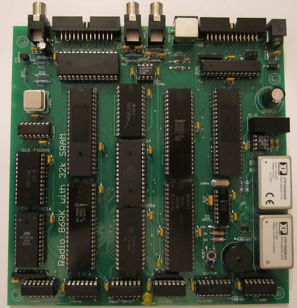

# Radio-86RK SRAM
The 2012 remake of the 1986 DIY 8-bit computer

## Contents
* [Introduction](#introduction)
* [Specifications](#specifications)
* [Hardware documentation](#hardware-documentation)
  * [Schematic and PCB Layout](#schematic-and-pcb-layout)
  * [Connectors](#connectors)
  * [Bill of Materials](#bill-of-materials)
  * [Memory Map](#memory-map)
* [Firmware documentation](#firmware-documentation)
  * [Monitor](#monitor)
  * [PS/2 adapter](#ps2-adapter)
* [Known Issues](#known-issues)

## Introduction
This project is a 2012 remake of [Radio-86RK](https://en.wikipedia.org/wiki/Radio-86RK), a DIY 8-bit computer the original design for which was published in 1986 by the Soviet *Radio* ham and DIY electronics magazine (hence the "Radio" and "86" in the name).

The original 1986 design targeted an enthusiast building it from scratch and was notable for its relative simplicity. Like most home computers of the era, it uses TV for video output and a cassette tape for program storage. Unlike most home computers, there is no color and no bitmapped graphics. You can get a feel of it via @begoon's excellent online [emulator](https://rk86.ru/) (the emulator's source code is [available on GitHub](https://github.com/begoon/rk86-js)).

The principal motivation behind this project was to replace the obsolete 1-bit DRAM memory and its supporting logic (address multiplexers, etc.) with a single 32KiB static RAM chip. A number of other changes has been made - see the [schematic](Eagle/Radio-86RK-SRAM-Schematic.pdf) for details. The project was initially [published](http://radio86rk.pbworks.com) around 2012 and since then has been built by a number of people, with one build even landing at the [Center for Computing History](http://www.computinghistory.org.uk/det/32376/Radio-86RK-(Russia)/) in Cambridge, thanks to @begoon. Also, this project seems to have inspired other designs, particularly @skiselev's [Radio-86RK](https://github.com/skiselev/radio-86rk) and [Radio86-RK-SRAM-128K](http://www.nedopc.org/forum/viewtopic.php?t=10660&start=0) by @shaos. 

## Specifications
  * CPU: Intel i8080 @ 2MHz
  * Memory: 32KiB RAM, 8 KiB ROM, optional 32KiB ROM cartridge (built-in or external)
  * Display: 64x25 alphanumeric monochrome (50Hz composite video output suitable for TV)
  * Keyboard: Proprietary 66-key (parallel interface) or any standard PS/2 (with built-in adapter)
  * Sound: 1-bit digital
  * I/O: Cassette tape recorder (use [mac2rk(https://github.com/mac2rk/mac2rk) to emulate tape)
  * Expansion: optional parallel port (required for ROM cartridges) 
  * Software: 2KiB ROM monitor; additional software can be loaded from a ROM cartridge or tape
  * Form factor: Mini-ITX (170x170 mm, 6.7x6.7 inch)
  * Power supply: 18-36VDC @ approx. 5W via barrel connector

## Hardware documentation

### Schematic and PCB Layout
[Schematic](Eagle/Radio-86RK-SRAM-Schematic.pdf)
[PCB Layout](Eagle/Radio-86RK-SRAM-Silk.pdf)

The computer is built around an Intel i8080 CPU (D6 on the schematic) with i8224 clock generator (D1). RAM and ROM are implemented with 62256 SRAM (D22) and 28C64 EEPROM (D17), respectively. Video subsystem includes an i8275 CRT controller (D8), i8257 DMA controller (D2) with address latch (D7), 28C16 font EEPROM (D12) and a parallel-in, serial-out shift register (D15). Two i8255 Programmable Peripheral Interfaces (PPIs) provide I/O connectivity. One PPI (D20) interfaces a cassete tape recorder and the parallel keyboard; a PS/2 keyboard can be connected via an onboard adapter (D30). The second PPI (D14) implements the expansion port, which can be used, among other things, to connect ROM cartridges. A 28C256 ROM cartridge can be either installed onboard (D30) or connected via a 26-way expansion header. The onboard power supply with power sequencing is built with three DC/DC converter modules (D33..D35) and an opamp (D32).

### Connectors
[Connectors](docs/Connectors.md)

### Bill of Materials
[Bill of Materials](docs/BOM.md)

### Memory Map
[Memory Map](docs/Memory_map.md)

## Firmware Documentation documentation

### Monitor

[Monitor commands and subroutines](docs/Monitor.md)

### PS/2 adapter
The PS/2 to parallel keyboard adapter based on an ATmega48/88/168/328 MCU was developed and [published](https://zx-pk.ru/threads/9294-orion-128-kontroller-ps-2-klaviatury.html) by Kamil Karimov (caro). The source code for the adapter is not available, but the binary is known to work. Note that this adapter requires that the keyboard support Scan Code Set 3. Most do, but some (e.g. Logitech K100) don't and will not work properly with the adapter.

There are two separate versions of the compiled binary: one for ATmega48/88 and one for ATmega168/328. When programming the ATmega, all fuses except CKDIV8 should be left in their default states. CKDIV8 should be left unprogrammed. (CKDIV8 is programmed by default, which clocks the ATmega at 1MHz. With this clock, only Caps Lock (= Rus/Lat) and Print Screen (= Reset) will work normally. Other keys will not work at all or will work partially or intermittently.)

## Known Issues

* Top silkscreen: R109, which sets the current for the "+12V" LED, has a wrong value. Instead oof 330 ohm, it should be between 1kOhm and 1.5kOhm
* PS/2 adapter requires that the keyboard support Scan Code Set 3. Most do, but some (e.g. Logitech K100) don't and do not work properly with the adapter.
